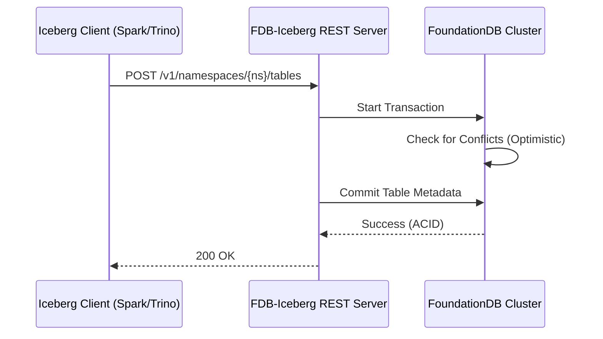

# FoundationDB-Iceberg Catalog

[](https://opensource.org/licenses/Apache-2.0)


An implementation of the **Apache Iceberg REST Catalog** specification backed by **FoundationDB**.

## 🚀 The Vision
Traditional Iceberg catalogs (JDBC/Hive) can become a bottleneck in high-concurrency environments. This project leverages FoundationDB’s **strictly serializable transactions** and **optimistic concurrency control** to provide a horizontally scalable, lock-free metadata control plane for modern data lakes.

## 🏗️ Architecture
By unbundling the catalog from the storage layer, we achieve high-throughput metadata operations while maintaining the ACID guarantees required for atomic Iceberg table commits.



## ✨ Key Features
* **REST Spec Compliant:** Works out-of-the-box with any Iceberg-compatible engine (PyIceberg, Spark, Trino, Flink).
* **ACID Foundations:** Uses FDB transactions to ensure table versions are never corrupted, even under heavy parallel write pressure.
* **Stateless Scaling:** The REST tier is entirely stateless; scale your API nodes to match your query volume.

## 🛠️ Getting Started (Quickstart)

### Prerequisites
* Java 17+
* A running FoundationDB cluster (or local `fdbmonitor`)

### Running with Docker (Coming Soon)
```bash
# Clone the repo
git clone [https://github.com/dlambrig/foundationdb-iceberg.git](https://github.com/dlambrig/foundationdb-iceberg.git)
cd foundationdb-iceberg

# Build and Run
./gradlew bootRun
```

## 🗺️ Roadmap & Maturity
This project is currently a **Technical Preview**. 

- [x] Namespace Management (Create/Drop/List)
- [x] Basic Table CRUD
- [ ] **Next Up:** Full Snapshot management logic
- [ ] **Next Up:** Integration testing with `Testcontainers` and `fdb-java`
- [ ] Multi-region metadata replication strategy

## 🤝 Contributing
This is an open-source exploration of high-performance metadata. If you've hit "Metastore scaling walls" before, I'd love your input on our FDB key-mapping strategy.

---
Created by [Dan Lambright](https://github.com/dlambrig)
```

