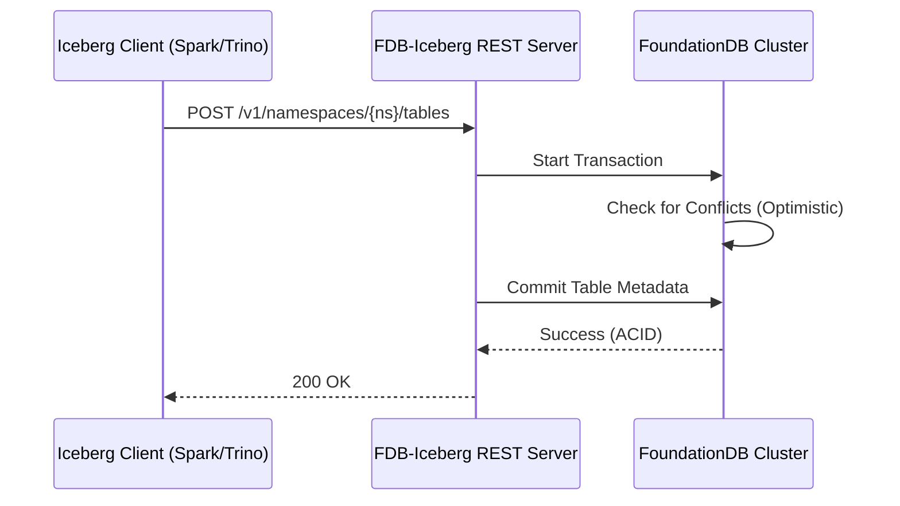

# FoundationDB-Iceberg Catalog

[](https://opensource.org/licenses/Apache-2.0)


An implementation of the **Apache Iceberg REST Catalog** specification backed by **FoundationDB**.

## 🚀 The Vision

This project uses
FoundationDB’s strictly serializable transactions and optimistic concurrency control to provide a transactional metadata service for Iceberg REST catalog
operations.

## 🏗️ Architecture
This project implements the Iceberg REST catalog layer on top of FoundationDB, using FoundationDB transactions for catalog metadata operations while
leaving table data and metadata files in external storage.



## ✨ Key Features
* **REST Spec Compliant:** Works out-of-the-box with any Iceberg-compatible engine (PyIceberg, Spark, Trino, Flink).
* **ACID Foundations:** Uses FDB transactions to ensure table versions are never corrupted, even under heavy parallel write pressure.
* **Stateless Scaling:** The REST tier is entirely stateless; scale your API nodes to match your query volume.

## Proven Coverage

The table below summarizes what is directly exercised today. It is meant to bound the compatibility claim, not overstate it.

| Area | Directly exercised | Memory mode | FDB mode | Restart/reload covered | Notes |
| --- | --- | --- | --- | --- | --- |
| Iceberg Open API RCK | Yes | Yes | No | No | `~/iceberg :iceberg-open-api:test` passes in this environment; latest run: 308 total, 290 passed, 18 skipped, 0 failed, 0 errors. |
| Trino direct | Yes | Yes | Yes | Yes | Smoke and FDB integration cover table lifecycle, metadata tables, schema evolution, views, and FDB restart/readback. |
| Spark direct | Yes | Yes | Yes | Yes | Smoke and FDB integration cover table lifecycle, schema evolution, overwrite, snapshots, replace-table, views, restart/readback, and concurrent writers against the same table. |
| Flink direct | Yes | Yes | Yes | Yes | Smoke and FDB integration cover table lifecycle, schema evolution, and FDB restart/readback. |
| REST-only integration | Yes | No | Yes | Yes | FDB integration also validates namespace/table/view pagination, metrics endpoint behavior, pointer stability, and conflict loops. |

What this does not claim:
* exhaustive compatibility with every engine path or every Iceberg client
* full production hardening beyond the exercised integration matrix above
* complete coverage of all optional or emerging Iceberg features

## 🛠️ Getting Started

### Prerequisites
* Java 17+ for local Gradle-based runs
* Docker Desktop (or another Docker engine) for the containerized workflow

### Run with Docker Compose

The checked-in `docker-compose.yaml` starts three containers:
* `fdb`: FoundationDB
* `iceberg-catalog`: this catalog server on port `8181`
* `spark-iceberg`: a Spark client container preconfigured to talk to the catalog over the Docker network

Start the stack from repo root:

```bash
git clone https://github.com/dlambrig/foundationdb-iceberg.git
cd foundationdb-iceberg
docker compose up --build -d
```

Note: on modern Docker installs the command is `docker compose` (with a space), not `docker-compose`.

Check that the services are up:

```bash
docker compose ps
docker compose logs -f iceberg-catalog
```

Verify the REST catalog is responding:

```bash
curl http://localhost:8181/v1/config
```

Open a shell in the Spark container:

```bash
docker compose exec spark-iceberg bash
```

From inside that container, start Spark SQL:

```bash
spark-sql
```

The Spark container is configured with an Iceberg REST catalog named `fdb`. Example SQL:

```sql
CREATE NAMESPACE IF NOT EXISTS fdb.demo;

CREATE TABLE fdb.demo.orders (
  order_id BIGINT,
  amount DOUBLE
) USING iceberg;

INSERT INTO fdb.demo.orders VALUES (1, 10.5), (2, 20.25);

SELECT * FROM fdb.demo.orders ORDER BY order_id;
```

Stop the stack:

```bash
docker compose down
```

If you want to remove persisted Docker volumes as well:

```bash
docker compose down -v
```

### Run Locally

Start the catalog server locally:

```bash
./gradlew runIcebergRestServer -Dfdb=true
```

Then run the direct Spark smoke suite against it:

```bash
SPARK_SQL_BIN=~/spark-3.5.5/bin/spark-sql ./integration/spark_smoke.sh --fdb
```

---
Created by [Dan Lambright](https://github.com/dlambrig)
```
