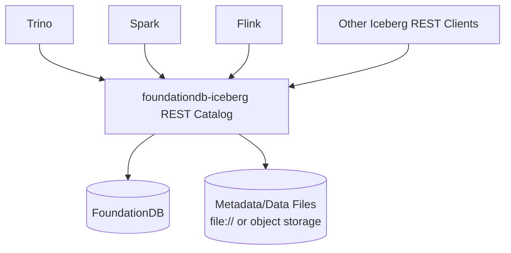
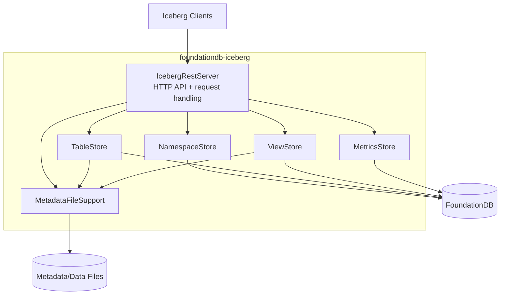
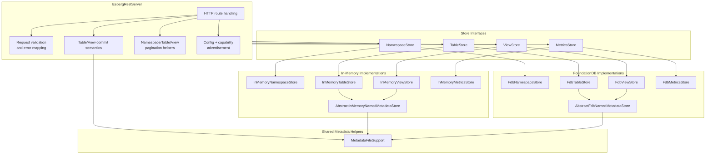

# Architecture

This document describes the current code structure of `foundationdb-iceberg` using a C4-style view in Mermaid.

## System Context

## Container View

## Component View

## Code Mapping

- `src/main/java/IcebergRestServer.java`
  - HTTP entrypoint
  - request parsing/validation
  - commit semantics
  - pagination and error handling

- `src/main/java/MetadataFileSupport.java`
  - metadata-location parsing
  - metadata file persistence/loading
  - metadata file cleanup
  - location/path resolution

- `src/main/java/NamespaceStore.java`
  - namespace abstraction

- `src/main/java/TableStore.java`
  - table abstraction

- `src/main/java/ViewStore.java`
  - view abstraction

- `src/main/java/MetricsStore.java`
  - metrics abstraction

- `src/main/java/AbstractInMemoryNamedMetadataStore.java`
  - shared in-memory table/view metadata behavior

- `src/main/java/AbstractFdbNamedMetadataStore.java`
  - shared FDB-backed table/view metadata behavior

- `src/main/java/InMemory*Store.java`
  - default local/dev backend

- `src/main/java/Fdb*Store.java`
  - FoundationDB-backed backend

## Notes

- The REST server stores namespace/table/view indexes in the selected backing store.
- Metadata JSON is persisted separately from the index entries and loaded through `MetadataFileSupport`.
- Memory mode and FDB mode share the same REST and commit logic; they differ mainly in how namespace/table/view/metrics indexes are stored.
